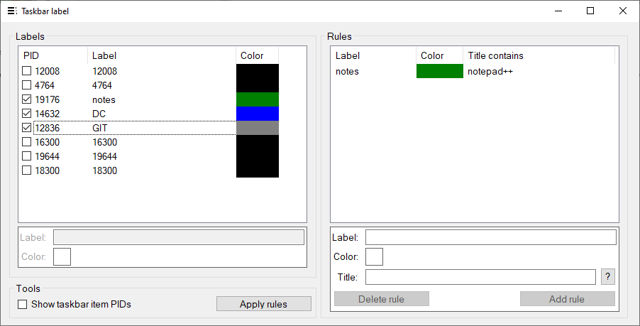

# Taskbar Labeler

Taskbar Labeler is a PoC/research/learning project.

It replaces the rendering of certain icons on the taskbar with a colored rectangle and some text.
Both the color of the rectangle and the text can be defined by the user.

Some parts of the project (mostly the injection code and the injected code) is based on [7-Taskbar-Numberer](https://github.com/m417z/7-Taskbar-Numberer) and [7-Taskbar-Tweaker](https://github.com/m417z/7-Taskbar-Tweaker).

## Pictures

## Public release

Some parts of the code was omitted from the public code release.
